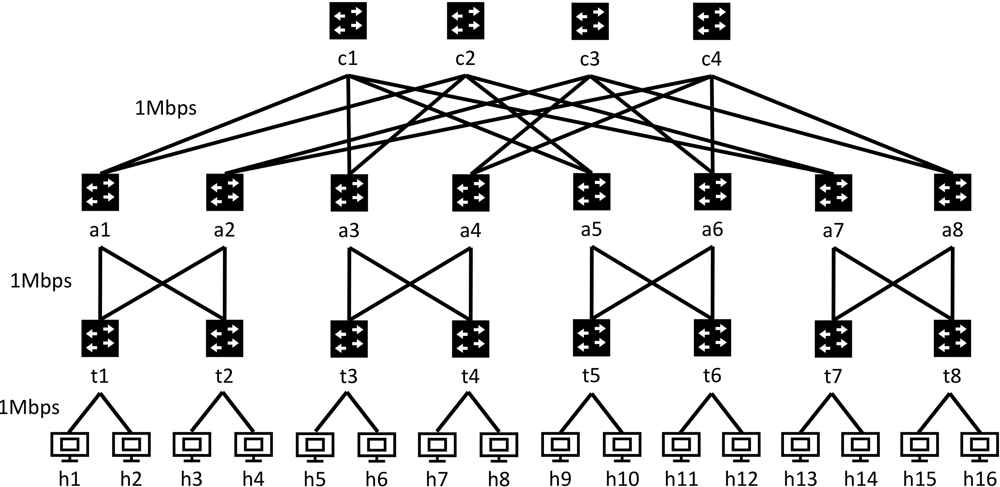

# Project 1: FatTree Topology

## Objectives
* Configure a FatTree topology with basic routing policies.
* Compare application performance (*i.e.,* `iperf`, `memcached`) between FatTree and Binary Tree.

## Getting Started

We first show you an example on how to build a Binary Tree topology. You will then write your own topology generator and controller to build a FatTree.

You will then build a single controller that routes applications to two cores. 

Finally, you can compare the performance of applicalication traffic on FatTree and Binary Tree. 

## Tutorial: Build a Binary Tree Topology
We build an example `I=4` layer Binary Tree topology with 16 hosts, 8 ToR switches, 7 internal switches, and multiple links with different bandwidth.


We first use a python script `topology/generate_binary_topo.py` to create the topology `topology/p4app_binary.json`. For example, to build the Binary Tree topology with `I=4`, you can run
```
./topology/generate_binary_topo.py 4
```
As you can see in `topology/generate_binary_topo.py`, the link bandwidth is specified like `["a1", "b1", {"bw": 2}]`, which means 2Mbit/sec between port `a1` and `b1`. 
Note that the link bandwidth actually translates into the speed of the two ports for that link in mininet (as you can see in the output of mininet: `(2.0Mbit) (2.0Mbit) (a1, b1)`).

Then you can run the Binary Tree topology by: 
```
sudo p4run --config topology/p4app_binary.json
```

Our controller is at `controller/controller_binary.py`. For `I=4`, you can run
```
./controller/controller_binary.py 4
```
You can then test the BinaryTree topology in the same way as your circle and line topologies in Project 0.

### Two optional configuration fields in p4app_*.json

You may find two configuration fields: `exec_scripts` and `default_bw` convenient to use.

1. `exec_scripts` allows you to add scripts that will be automatically called after the topology starts. The scripts will be called in the `root` namespace, not inside any host. 
    For example, by adding 
    ```
        "exec_scripts": [
            {
               "cmd": "./controller/controller_binary.py 4",
               "reboot_run": true
            }
        ],
    ```
    inside the outermost `{}` in `p4app_binary.json`, you don't have to run the controller manually anymore.
    If for debugging reasons you want to start the controller yourself just remove this option (setting `reboot_run` to false does not suffice).

2. `default_bw` can be used to set the default bandwidth of all the links in the topology. For example, by adding 
    ```
    "default_bw": 1,
    ```
    inside the `topology` `{}` in `p4app_binary.json`, you set the default link bandwidth to 1Mbps; you can overwrite specific link (eg, `a1-b1`) bandwidth to 2Mbps by writing `["a1", "b1", {"bw": 2}]` inside `links` field under `topology`. Note that a link without any bandwidth setting (ie, no default value and no specific value) will have infinite bandwidth. 


## Your task: Build a FatTree Topology
You will now extend the Binary Tree to a FatTree topology by modifying `topology/generate_fattree_topo.py` and `controller/controller_fattree_onecore.py`.
Below, we provide detailed steps for creating a FatTree topology with k=4; you solution should work for `k=4, 6, 8`.

### Step One: Create the Topology
You should write a script `topology/generate_fattree_topo.py` to generate the topology file. Your script should take *k* as the input and output to `topology/p4app_fattree.json`. For example, to generate the FatTree topology with 16 hosts, we will run:
```
./topology/generate_fattree_topo.py 4
```

The following figure illustrates an example FatTree topology with `k=4` where `k` is the number of ports each switch has. This FatTree topology contains `16` hosts `h1-h16`, `8` ToR switches `t1-t8`, `8` aggregate switches `a1-a8`, `4` cores switches `c1-c4`, and multiple links with the same bandwidth (*i.e.,*  1Mbps).

**Please make sure you use exactly the same switch and host names as the figure. Otherwise, we cannot test your reachability and you would not get the grades.**
Your generated topology file `topology/p4app_fattree.json` should have all link bandwidth set to 1Mbps. (Check how we set link bandwidth previously for Binary Tree.) 

### Step Two: Write the Controller
Now modify `controller/controller_fattree_onecore.py` for all the switches. The script should take an input `k`. For example, you can run the following for k=4:
```
./controller/controller_fattree_onecore.py 4
```
Your main goal is to enable all-to-all communications in the topology (i.e., the `pingall` command in mininet should succeed).
You can test your solution using ``pingall`` to test the solution. 
Currently, you should **route all the traffic through the first Core switch (*i.e.,* switch c1)**. We will explore routing through multiple switches later. 

**Hint 1:** You need to treat the switches each layer separately. For the switches in each layer, you may install one rule for each host indicating which port it needs to be forwarded.

**Hint 2:** You may run `links` or `net` command in Mininet to check the port mappings. The port mappings should keep the same if your topology JSON file keeps the same. However, if the topology JSON file changes (e.g., the order you list the switches and hosts), the port mappings might be different.

**Hint 3:** How do you compute the port number for each host without listing them all in an array?

**Hint 4:** In Mininet, switches do not support the same packets coming into and then immediately coming out from the same port. For example, you cannot let a packet goes from h1 to t1, and set rules on t1 to let the packet route back to h1 immediately. Your forwarding rules should avoid this kind of behavior since it will cause failures in `pingall`.

**Hint 5:** For debugging, you may start by testing ping between a pair of hosts before trying out `pingall`.

**Food for thought:** Do you really need one rule for each host?

### Test your code
This is how we will grade your code. We will run the scripts on multiple terminals in the same way as project 0.
```
./topology/generate_fattree_topo.py 4
sudo p4run --config topology/p4app_fattree.json
./controller/controller_fattree_onecore.py 4
```
Finally, we can run the automatic tests as follows:
```
./test_scripts/test_fattree_topo.py 4
```

**You solution should work with `k=4, 6, 8` for FatTree.** We will use scripts to automatically test your code for each of `k`. Your score will be halved if you write specific cases for each of `k`. We will manually check your code to identify this problem. 

## Compare application performance between Binary Tree and FatTree
Now let's run applications on our Binary Tree topology (with `I=4`) and FatTree topology (with `k=4`) and compare their performance.

### Bandwidth configuration
In FatTree, we set the bandwidth to **1Mbps**, because the **total capacity of each switch to 4Mbps**.

The question is what bandwidth we should set for Binary Tree so it is a fair comparison with FatTree. 
We assume the Binary Tree topology can only use the same type of switches (i.e., with a total capacity of 4Mbps), we get:

- For the two down links of switch `a1` in Binary Tree, their bandwitdth is set to **2Mbps** (*i.e.*,4Mbps / 2)
- For the four down links of switches `bX`, their bandwidth is set to **1Mbps** (*i.e.*, (4Mbps - 2Mbps) / 2)
- For the eight down links of switches `cX` and the sixteen down links of switches `dX`, we just set them as **1Mbps**

### Traffic trace
We run two applications which you used in project 0 as well: `memcached` is an application with lots of small messages while `iperf` send long persistent flows.

We use `apps/trace/project1.json` to describe the traffic trace. We let `memcached` send traffic between `h1` and `h9` and let `iperf` send traffic between `h4` and `h12`. 

Then you can use the following commands to generate the traffic trace and send traffic based on the trace. 
```
./apps/trace/generate_trace.py ./apps/trace/project1.json
sudo ./apps/send_traffic.py --trace ./apps/trace/project1.trace
```
Note that the `generate_trace.py` scripts essentially just run the `memcached` and `iperf` commands you used in project 0, but allow us to run more complex traffic traces more efficiently for this project and future ones.

### Write a two-core controller for FatTree
Our previous FatTree controller uses a single core switch. But we now run two applications, which may cause traffic congestion at the single core switch. So let's write a new controller that isolates the traffic of `memcached` and `iperf` applications by routing them to different core switches in FatTree topology. Specifically, you need to write a new controller `controller_fattree_twocore.py` that routes traffic using two core switches: For ease of grading, you should install rules that routes all traffic to hosts with odd number (i.e., those `dmac` addresses belong to `h1,3,5,7,9,11,13,15`) to core switch `c1`, and all traffic to hosts with even number (i.e., those `dmac` addresses belong to `h2,4,6,8,10,12,14,16`) to core switch `c2`. Given that `memcached` send traffic between `h1` and `h9`, the above rules will direct `memcached` traffic to `c1`. Similarly, `iperf` traffic between `h4` and `h12` goes to `c2`. Your new controller should also make mininet `pingall` succeed (for cases of `k=4, 6, 8`). 

Note that the above routing rules are just for your convenience. In practice, we identify memcached and iperf trraffic based on port numbers and traffic patterns and route traffic based on these features.

After you have finished the new controller for FatTree, you need to run the following experiments (you only need to run these experiments for `k=4` case): 

### Experiments

- **Expr 1-1:** Run the traffic trace above on FatTree topology using a single core switch 
- **Expr 1-2:** Run the traffic trace above on FatTree topology using two core switches 
- **Expr 1-3:** Run the traffic trace above on Binary Tree topology

For each experiment, you will get the average throughput for `iperf` and average memcached latency for `memcached`.

**Note**: the numbers can vary from time to time. It is better to run the experiments for at least 5 times to see the difference between different versions.

### Questions
You should answer the following questions in your report.md (see [Submission and Grading](#submission-and-grading))) (just one or two sentences for each question mark):

* What is the average latency of memcached in the three experiments? Please include the screenshots of three memcached latency results.
* Compare the average latency of memcached in the three experiments and explain why
* What is the average throughput of iperf in the three experiments? Please include the screenshots of three iperf throughput results. 
* Compare the average throughput of iperf in the three experiments and explain why

### Optional experiment (This not extra credit but just for you to have some fun experiments)
Can you try to replace `memcached` with the video application used in Project 0? 
- Remove the `memcached` part in `apps/trace/project1.json`
- Regenerate the traffic trace and run the `iperf` trace
```
./apps/trace/generate_trace.py ./apps/trace/project1.json
sudo ./apps/send_traffic.py --trace ./apps/trace/project1.trace
```
- At the same time, run the video application between `h1` and `h9` (following the instructions in project 0)

What do you observe? Why?

## P4 Network Visualizer for Debugging
Daniel Rodrigues who took CS145 in spring 2020 made this [P4 network Visualizer](https://github.com/Danieltech99/P4-Network-Visualizer) tool as his final project. The tool can show the link traffic rate in real time, which might be useful for debugging.  

Note that we havn't fully tested the tool. We may not have timely response to fix the problems you face when using this tool. Please file tickets on that github if you face problems.

This is also an example project for our final open-ended project 7. The final project is a chance for you to contribute to this class. So start thinking about project ideas as you work on Project 1-6. 

## Submission and Grading

### What to submit
You are expected to submit the following documents:

1. Code: the programs that you write to generate the FatTree topologies with different `k` (`topo_fat_gen.py`), and the controller programs (with `k` as an input parameter) that you write to generate the forwarding rules for FatTree topologies with one core switch and two core switches (`controller_fattree_onecore.py` and `controller_fattree_twocore.py`). We will use scripts to automatically test them (i.e., `tests/test_fat_topo.py`).

2. report/report.md: In this file you should describe how you generate the FatTree topologies, how to use your topology generating programs, how you generate the forwarding rules for different routing policies, answer the questions posted above, and your memcached latency and iperf throughput screenshots in [Questions](#questions). 

You are expected to tag the version you would like us to grade on using following commands and push it to your own repo. You can learn from this [tutorial](https://git-scm.com/book/en/v2/Git-Basics-Tagging) on how to use `git tag` command. This command will record the time of your submission for our grading purpose.
```
git tag -a submission -m "Final Submission"
git push --tags
```


### Grading

The total grades is 100:

- 20: For your description of how you generate topologies (links and routing rules) in report.md.
- 10: For your answers to the questions in report.md.
- 60: We will test the connectivity of your solutions for FatTree with different `k`; each with score of 20. The score is proportional to the percentage of pairs that are connected. (60 means all can be connected). Your scores will be halved if you write separate lines of code for different k values.
- 10: We will use scripts to automatically check the correctness of your solutions for separated core switches forwarding scheme.
- Deductions based on late policies


### Survey

Please fill up the survey when you finish your project.

[Survey link](https://docs.google.com/forms/d/e/1FAIpQLSdYKtTi5tlOSuF6YLG-9M5HVOUm_RDyGWJ8ulyi9-3R7PBsaA/viewform?usp=sf_link)
